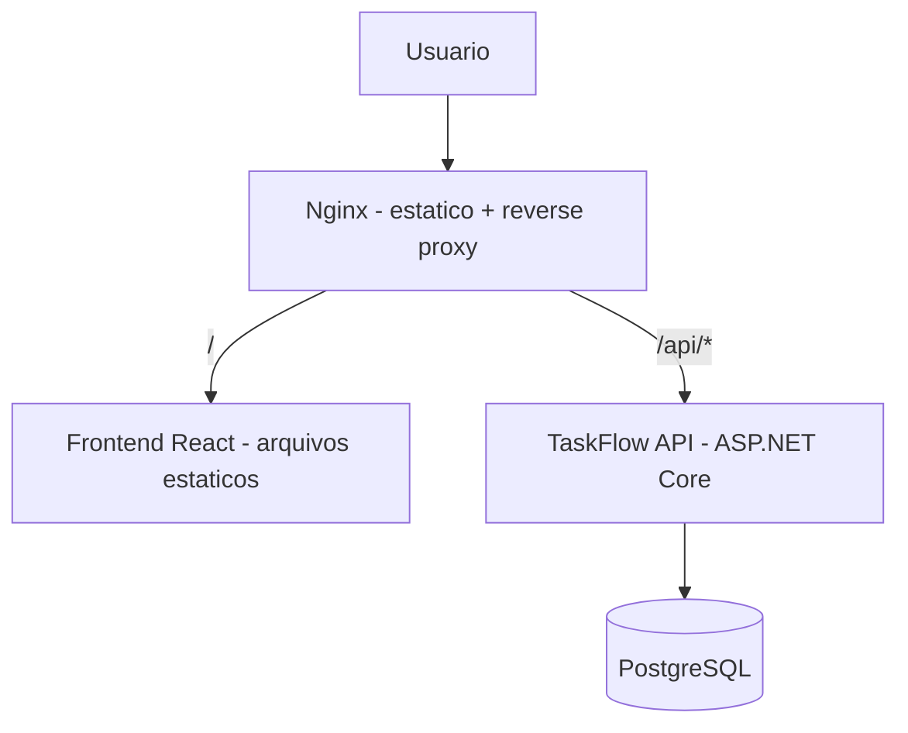
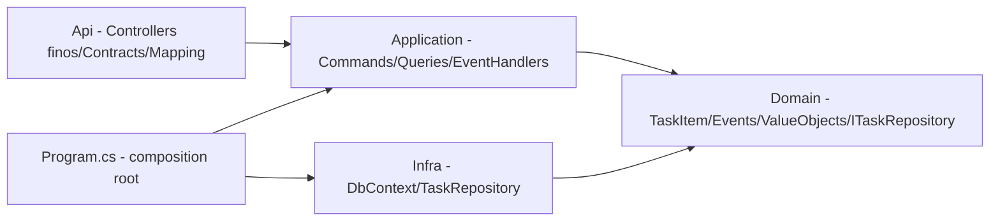

# Arquitetura — TaskFlow

**Atualizado em:** 2026-09-11
**Baseado no ADR:** v1.1

## 1. Contexto (o que o sistema é)

TaskFlow é uma API REST de gerenciamento de tarefas (CRUD de Task) com um frontend React,
usada só pelo próprio autor, sem autenticação. O sistema conversa apenas com um banco
PostgreSQL próprio; não há sistemas externos. Desde a Fase 0, API e banco rodam cada um em
seu próprio container Docker. Desde 2026-09-12 (unificação das Fases 2 e 5, ver
`DECISIONS.md`), um único Nginx containerizado — buildado a partir do `nginx/Dockerfile`
multi-stage, que também builda o frontend — serve os arquivos estáticos do React **e**
faz reverse proxy de `/api/*` para a API. Optou-se deliberadamente por um Nginx só (em vez
de o frontend ter seu próprio container) dado o tamanho do laboratório; candidato a
revisitar se/quando Kubernetes entrar (Fase 6).

## 2. Componentes (os módulos e suas fronteiras)

| Módulo | Responsabilidade | Pode importar de | NÃO pode importar de |
|--------|------------------|------------------|----------------------|
| Api (Controllers) | Controllers **finos** (só traduzem HTTP <-> Mediator), Contracts (Requests/Responses), Mapping | Application | Infra (só `Program.cs`, como composition root, referencia Infra para o DI); Domain (Controllers não constroem mais value object nenhum) |
| Application | Commands/Queries (CQRS via MediatR), handlers, `Notification`→`Result` na fronteira, `IDomainEventDispatcher`, Event Handlers | Domain | Infra, Api |
| Domain | `TaskItem` (`IAggregateRoot`), Domain Events (`TaskCreatedEvent`/`TaskStatusChangedEvent`/`TaskDeletedEvent`), value objects, `Notification`, `ITaskRepository` | (nada) | Infra, Api, Application (Domain não conhece MediatR nem nenhum framework) |
| Infra | `TaskFlowDbContext`, `TaskRepository` (implementa `ITaskRepository`), Migrations | Domain | Api, Application |

Dependency Inversion: a Api depende só do `IMediator` e dos Commands/Queries da
Application — nunca do `ITaskRepository`/`TaskFlowDbContext` diretamente. Quem conhece
Infra e Application ao mesmo tempo é exclusivamente `Program.cs`, no papel de
composition root.

**Fluxo de um Command (ex.: criar task):** `TasksController` → `IMediator.Send` →
`CreateTaskCommandHandler` (Application) → constrói value objects, valida via
`Notification` → `ITaskRepository` (Domain) → `TaskRepository` (Infra) → Postgres. Após o
`SaveChangesAsync`, o handler dispara `TaskItem.DomainEvents` via
`IDomainEventDispatcher`, que publica cada evento como uma
`DomainEventNotification<T>` do MediatR — os Event Handlers (hoje só logam) reagem a
partir daí.

## 3. Invariantes de arquitetura

- [x] Domain não importa de Infra, Api nem Application (nem de MediatR — os eventos são
      POCOs puros, a ponte pro MediatR vive só na Application)
- [x] Controllers da Api não referenciam `TaskFlow.Infra` nem `TaskFlow.Domain` — só
      `TaskFlow.Application` (via Commands/Queries) e `Program.cs` monta o resto
- [x] Regra de negócio validada uma única vez, nos value objects do Domain — nunca
      duplicada na Api nem na Application
- [x] Toda mutação de estado (Create/Update/Delete) dispara seu Domain Event
      correspondente, dispatchado só depois do `SaveChangesAsync` ter sucesso
- [x] Nenhuma configuração de Nginx/Docker/CI referencia detalhes internos do código C#
      (endereços fixos de porta interna são a única exceção aceitável)

## 4. Fitness Functions (regras vivas, checadas por fase)

| Fitness Function | Como checar (agente) | Status última revisão |
|------------------|----------------------|------------------------|
| Domínio não referencia EF Core/Infra/MediatR | grep de `using` no namespace Domain | pass (2026-09-11) |
| Controllers da Api não referenciam `TaskFlow.Infra` nem `TaskFlow.Domain` diretamente | grep de `using` nos Controllers | pass (2026-09-11) |
| Regra de negócio validada em um único lugar (Domain), nunca reimplementada | revisão manual dos Command Handlers e do Controller | pass (2026-09-11) |
| Migrations versionadas, nunca DDL manual em produção | revisão do histórico de migrations | pass (2026-09-09) |
| Contrato dos 5 endpoints estável entre Fases 1-5 | comparação manual de request/response — 11/11 checks após o refactor DDD | pass (2026-09-11) |
| Domain Event disparado só após persistência confirmada | revisão manual dos Command Handlers + log dos Event Handlers | pass (2026-09-11) |
| Infra (Nginx/Docker/Compose/CI) não exige mudança no código da API | revisão manual no gate de fase | pass (2026-09-12) |

## 5. Desvios conhecidos do ADR

- nenhum
