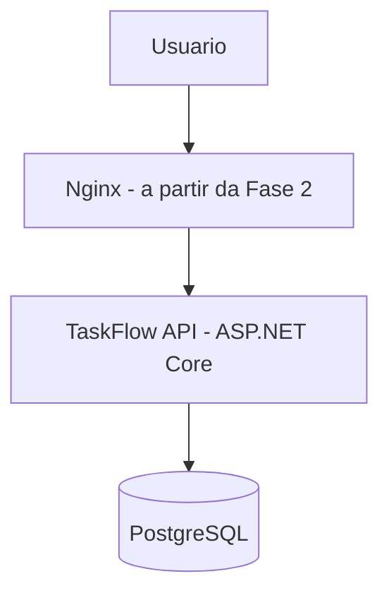
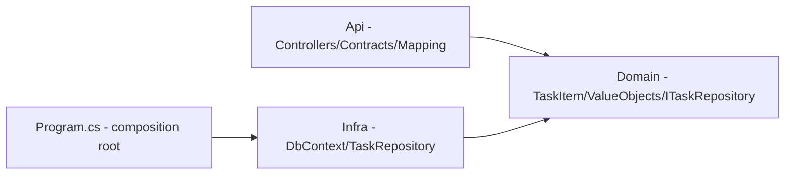

# Arquitetura — TaskFlow

**Atualizado em:** 2026-09-09
**Baseado no ADR:** v1.0

## 1. Contexto (o que o sistema é)

TaskFlow é uma API REST de gerenciamento de tarefas (CRUD de Task), usada só pelo próprio
autor, sem autenticação. O sistema conversa apenas com um banco PostgreSQL próprio; não há
sistemas externos. Desde a Fase 0, API e banco rodam cada um em seu próprio container
Docker. A partir da Fase 2, um Nginx (também containerizado) passa a ficar na frente da
API como reverse proxy; a partir da Fase 5, um frontend React consome a mesma API.

## 2. Componentes (os módulos e suas fronteiras)

| Módulo | Responsabilidade | Pode importar de | NÃO pode importar de |
|--------|------------------|------------------|----------------------|
| Api (Controllers) | Controllers, Contracts (Requests/Responses), Mapping, validação via value objects | Domain | Infra (só `Program.cs`, como composition root, referencia Infra para o DI) |
| Domain | `TaskItem`, value objects (`TaskTitle`/`TaskDescription`), `Notification`, `ITaskRepository` | (nada) | Infra, Api |
| Infra | `TaskFlowDbContext`, `TaskRepository` (implementa `ITaskRepository`), Migrations | Domain | Api |

Dependency Inversion: a Api depende só da abstração `ITaskRepository` (definida no
Domain), nunca do `TaskFlowDbContext` (tipo concreto do Infra). Quem conhece os dois
lados é exclusivamente `Program.cs`, no papel de composition root.

## 3. Invariantes de arquitetura

- [x] Domain não importa de Infra nem de Api
- [x] Controllers da Api não referenciam `TaskFlow.Infra` — só `Program.cs` (composition
      root) monta a implementação concreta
- [x] Regra de negócio validada uma única vez, nos value objects do Domain — nunca
      duplicada na Api
- [ ] Nenhuma configuração de Nginx/Docker/CI referencia detalhes internos do código C#
      (endereços fixos de porta interna são a única exceção aceitável)

## 4. Fitness Functions (regras vivas, checadas por fase)

| Fitness Function | Como checar (agente) | Status última revisão |
|------------------|----------------------|------------------------|
| Domínio não referencia EF Core/Infra | grep de `using` no namespace Domain | pass (2026-09-09) |
| Controllers da Api não referenciam `TaskFlow.Infra` diretamente | grep de `using TaskFlow.Infra` fora de `Program.cs` | pass (2026-09-09) |
| Regra de negócio validada em um único lugar (Domain), nunca reimplementada na Api | revisão manual do Controller | pass (2026-09-09) |
| Migrations versionadas, nunca DDL manual em produção | revisão do histórico de migrations | pass (2026-09-09) |
| Contrato dos 5 endpoints estável entre Fases 1-5 | comparação manual de request/response | pass (2026-09-09) |
| Infra (Nginx/Docker/Compose/CI) não exige mudança no código da API | revisão manual no gate de fase | pass (2026-09-09) |

## 5. Desvios conhecidos do ADR

- nenhum
