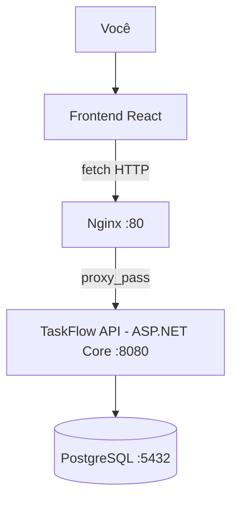

# TaskFlow

Um gerenciador de tarefas simples, de propósito duplo: é uma ferramenta pessoal de verdade
(quadro Kanban, criar/mover/excluir tasks) e, principalmente, **um laboratório de
infraestrutura**. O CRUD de tarefas existe só para dar a esse laboratório algo real para
rodar — o objetivo nunca foi o CRUD em si, foi ter um motivo concreto para montar, na
prática, cada camada que separa "código rodando na minha máquina" de "sistema operando de
verdade": proxy reverso, containerização, orquestração, CI/CD e, adiante, observabilidade.

Cada decisão de arquitetura, cada bug encontrado e cada fase concluída estão registrados
nos documentos do projeto (seção [Documentação](#documentação) abaixo) — este README é o
ponto de entrada, não a fonte única da verdade.

---

## Índice

- [O que o projeto é](#o-que-o-projeto-é)
- [Arquitetura atual](#arquitetura-atual)
- [Funcionalidades](#funcionalidades)
- [Stack](#stack)
- [A jornada de infraestrutura (o motivo do projeto existir)](#a-jornada-de-infraestrutura-o-motivo-do-projeto-existir)
- [Como rodar](#como-rodar)
- [Testes](#testes)
- [Estrutura de pastas](#estrutura-de-pastas)
- [Estado atual](#estado-atual)
- [Documentação](#documentação)

---

## O que o projeto é

Uma API de tarefas (Task = título, descrição, status, timestamps) com um frontend em
React consumindo ela, tudo rodando containerizado atrás de um Nginx, orquestrado por
Docker Compose, com pipeline de CI/CD no GitHub Actions. Uso pessoal e local — sem
autenticação, sem múltiplos usuários, sem nada além do necessário para o laboratório
fazer sentido.

Se um dia alguém perguntar "por que Nginx na frente de uma API que só um usuário acessa?"
— a resposta é: porque o objetivo é aprender a montar essa peça, não porque a Task
precisa disso.

## Arquitetura atual



Backend, frontend, Nginx e banco rodam cada um no seu próprio container Docker,
orquestrados por um único `docker-compose.yml`. Detalhes de componentes, invariantes e
fitness functions: [ARCHITECTURE.md](ARCHITECTURE.md).

## Funcionalidades

**Backend (API REST):**

| Método | Rota | O que faz |
|---|---|---|
| `POST` | `/api/tasks` | cria uma task (status default `TODO` se omitido) |
| `GET` | `/api/tasks` | lista todas as tasks |
| `GET` | `/api/tasks/{id}` | busca uma task por id |
| `PUT` | `/api/tasks/{id}` | atualiza título, descrição e status |
| `DELETE` | `/api/tasks/{id}` | remove uma task |
| `GET` | `/health` | health check |

Validação de negócio (título obrigatório, tamanho máximo) vive só no domínio e devolve
**todos** os erros de uma vez em `{"errors": [...]}` — não só o primeiro. Contrato
completo: [SDD.md](SDD.md).

**Frontend (quadro Kanban):**

- 3 colunas fixas (`TODO` / `IN_PROGRESS` / `DONE`), consumindo a API real — criar,
  mudar status e excluir refletem na tela sem reload manual.
- Criação inline (sem modal) direto na coluna `TODO`.
- Tema claro/escuro com alternância manual (switch deslizante no header), persistido
  entre visitas.
- Responsivo: 3 colunas lado a lado no desktop, scroll horizontal com "snap" no
  mobile/tablet (uma coluna quase em tela cheia por vez).
- Todo componente interativo cobre estado default, hover, foco por teclado e desabilitado
  — nada sobe só com o "caminho feliz". Base de design completa: [DESIGN.md](DESIGN.md).

## Stack

| Camada | Tecnologia |
|---|---|
| Backend | C# / ASP.NET Core Web API (.NET 10), Entity Framework Core |
| Banco | PostgreSQL |
| Frontend | React 19 + TypeScript, Vite, Tailwind CSS v4, TanStack Query, lucide-react |
| Infra | Nginx, Docker, Docker Compose, GitHub Actions |
| Testes | xUnit (backend), Playwright (E2E do frontend) |

Cada escolha foi decidida por consenso num Stack Grill, com alternativas descartadas
registradas — tabela completa em [ADR.md](ADR.md).

## A jornada de infraestrutura (o motivo do projeto existir)

O projeto foi montado em fases deliberadamente pequenas, cada uma isolando **uma** peça
de infraestrutura para aprender por vez, em vez de já nascer com tudo pronto:

| Fase | O que entrou | Por quê |
|---|---|---|
| **0 — Esqueleto** | API + Postgres, cada um em seu container, sem instalar nada no host | Aprender a rodar uma aplicação real dentro de containers desde o primeiro commit |
| **1 — CRUD completo** | Os 5 endpoints, validação, testes automatizados | Ter algo de verdade para as próximas fases de infra operarem sobre |
| **2 — Nginx** | Reverse proxy na frente da API (`proxy_pass`, logs de acesso) | Entender o papel de um proxy reverso: uma porta pública, uma API "escondida" atrás |
| **3 — Docker Compose** | Os 3 containers sobem com um único comando, healthcheck no Postgres, segredos em `.env` | Passar de "3 comandos `docker run` manuais" para orquestração declarativa |
| **4 — CI/CD** | GitHub Actions: testes + build da imagem a cada push | Fechar o ciclo de "todo push é validado automaticamente", não só localmente |
| **5 — Frontend** | React consumindo a API real | Provar a stack de ponta a ponta com uma interface de verdade, não só `curl` |
| **6 — Melhorias** *(futuro)* | HTTPS, health checks robustos, logs estruturados, Grafana e, eventualmente, Kubernetes/GCP | Aproximar o laboratório de uma operação "de produção de verdade" |

Cada fase tem uma revisão de arquitetura registrada (drift, acoplamento, dependências
novas, fitness functions) em [ARCH-REVIEWS.md](ARCH-REVIEWS.md), e toda decisão
estrutural — inclusive as que não deram certo de primeira, como o `depends_on` do Compose
que não esperava o Postgres ficar pronto — está documentada em [DECISIONS.md](DECISIONS.md).

## Como rodar

Pré-requisito: Docker Desktop instalado e rodando. Não é necessário instalar .NET SDK
nem PostgreSQL diretamente na máquina — a API já roda containerizada desde a Fase 0.

### Backend + banco + Nginx (Docker Compose — recomendado)

```powershell
copy .env.example .env    # ajuste as credenciais se quiser
docker compose up -d --build
```

Isso sobe os 3 serviços (`postgres`, `api`, `nginx`), aplica as migrations do EF Core
automaticamente e publica:
- API direto: `http://localhost:8090`
- API via Nginx: `http://localhost:80`

Health check: `curl http://localhost:8090/health` deve retornar `{"status":"healthy"}`.

Para derrubar (os dados do Postgres persistem no volume nomeado `taskflow-pgdata`):
```powershell
docker compose down
```

> Portas 8080/8081 podem já estar em uso por outro projeto local — se for o caso, ajuste
> o mapeamento de portas em `docker-compose.yml`.

### Frontend

```powershell
cd frontend
copy .env.example .env    # aponta para a API em localhost:8090 por padrão
npm install
npm run dev
```

Abre em `http://localhost:5173`. A API precisa estar rodando (Compose acima) — CORS já
está liberado para essa origem.

### Como rodar cada peça manualmente (Fases 0-2, para aprendizado)

O Compose é a forma recomendada no dia a dia. Os comandos abaixo mostram como cada peça
funciona isoladamente — úteis para entender o que o Compose está automatizando.

```powershell
# Rede compartilhada entre os containers manuais
docker network create taskflow-net-manual

# Postgres
docker run -d --name taskflow-postgres --network taskflow-net-manual `
  -e POSTGRES_DB=taskflow -e POSTGRES_USER=taskflow -e POSTGRES_PASSWORD=taskflow `
  -v taskflow-pgdata-manual:/var/lib/postgresql/data `
  -p 5432:5432 postgres:17-alpine

# API (a imagem já aplica as migrations sozinha no startup)
docker build -f backend/docker/api.Dockerfile -t taskflow-api backend/
docker run -d --name taskflow-api --network taskflow-net-manual `
  -e ConnectionStrings__Default="Host=taskflow-postgres;Port=5432;Database=taskflow;Username=taskflow;Password=taskflow" `
  -p 8090:8080 taskflow-api

# Nginx na frente da API
docker run -d --name taskflow-nginx --network taskflow-net-manual `
  -v ${PWD}\nginx\nginx.conf:/etc/nginx/nginx.conf:ro `
  -p 80:80 nginx:alpine
```

### Loop de desenvolvimento do backend (hot reload, sem rebuild de imagem)

```powershell
docker compose up -d postgres nginx

docker run --rm -it --name taskflow-api-dev --network taskflow-react-aspnet_default `
  -e ConnectionStrings__Default="Host=taskflow-postgres;Port=5432;Database=taskflow;Username=taskflow;Password=taskflow" `
  -v ${PWD}\backend:/src -w /src/src/TaskFlow.Api `
  -p 8090:8080 mcr.microsoft.com/dotnet/sdk:10.0 `
  dotnet watch run --urls http://0.0.0.0:8080
```

## Testes

```powershell
# Backend (xUnit) — precisa do Postgres no ar (via Compose)
docker run --rm --network taskflow-react-aspnet_default `
  -e ConnectionStrings__Default="Host=taskflow-postgres;Port=5432;Database=taskflow;Username=taskflow;Password=taskflow" `
  -v ${PWD}\backend:/src -w /src mcr.microsoft.com/dotnet/sdk:10.0 dotnet test TaskFlow.slnx

# Frontend E2E (Playwright) — precisa do dev server e da API no ar
cd frontend
npm run test:e2e
```

## Estrutura de pastas

```
taskflow-react-aspnet/
├── backend/           # solução .NET (Api, Domain, Infra, testes)
├── frontend/          # app React (Vite + TypeScript + Tailwind)
├── nginx/             # config do reverse proxy
├── docker-compose.yml
├── .github/workflows/ # CI/CD
└── *.md               # documentação do projeto (ver abaixo)
```

## Estado atual

- ✅ Fases 0-3 (esqueleto containerizado, CRUD, Nginx, Compose) — completas e testadas.
- ✅ Fase 5 (frontend) — completa e testada (build, lint, E2E); falta só sua aprovação
  visual final.
- ⚠️ Fase 4 (CI/CD) — workflow escrito (`.github/workflows/ci.yml`) e comandos
  verificados localmente, mas nunca rodou de verdade no GitHub Actions: isso exige um
  `git push`, e por instrução deste projeto o agente não commita nem dá push sozinho.
- ⏳ Fase 6 (HTTPS, observabilidade, Grafana, Kubernetes/GCP) — planejada, não iniciada.

Detalhe fase a fase, critérios de conclusão e o que falta: [ROADMAP.md](ROADMAP.md).

## Documentação

| Documento | O que responde |
|---|---|
| [PRD.md](PRD.md) | Qual problema o projeto resolve e para quem |
| [CONTEXT.md](CONTEXT.md) | Glossário de domínio (Task, Status, etc.) |
| [ADR.md](ADR.md) | Stack decidida, alternativas descartadas, metodologia |
| [ARCHITECTURE.md](ARCHITECTURE.md) | Como o sistema funciona agora (componentes, invariantes) |
| [SDD.md](SDD.md) | Contrato dos módulos e da API |
| [DESIGN.md](DESIGN.md) | Paleta, tipografia, estados de componente, responsividade |
| [ROADMAP.md](ROADMAP.md) | Fases, critérios de conclusão, o que falta |
| [DECISIONS.md](DECISIONS.md) | Histórico de decisões estruturais e por quê |
| [ARCH-REVIEWS.md](ARCH-REVIEWS.md) | Revisão de arquitetura ao final de cada fase |
| [CLAUDE.md](CLAUDE.md) | Índice operacional para quem (ou o quê) for mexer no código |
